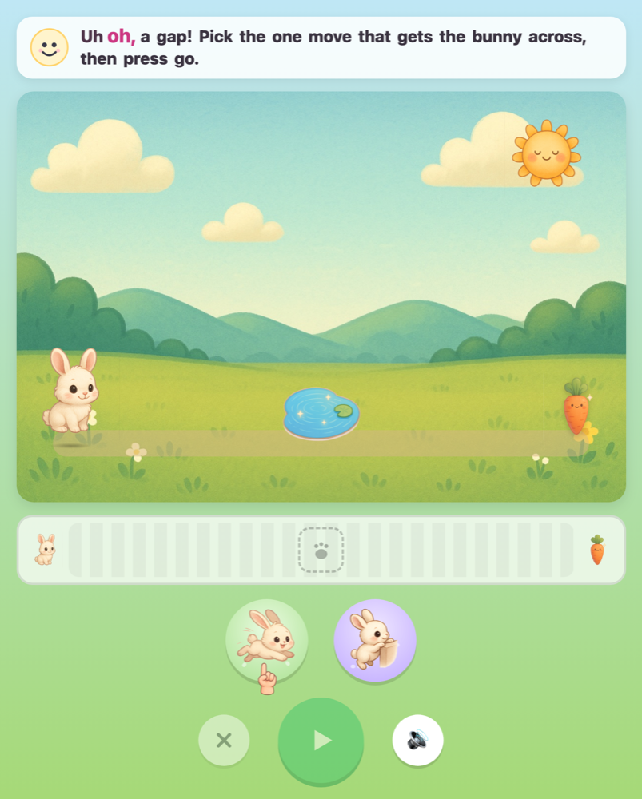
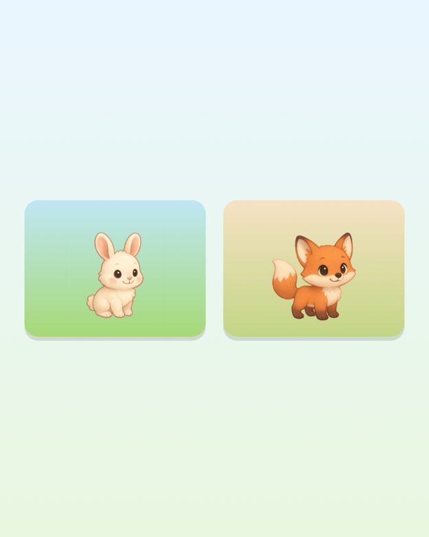
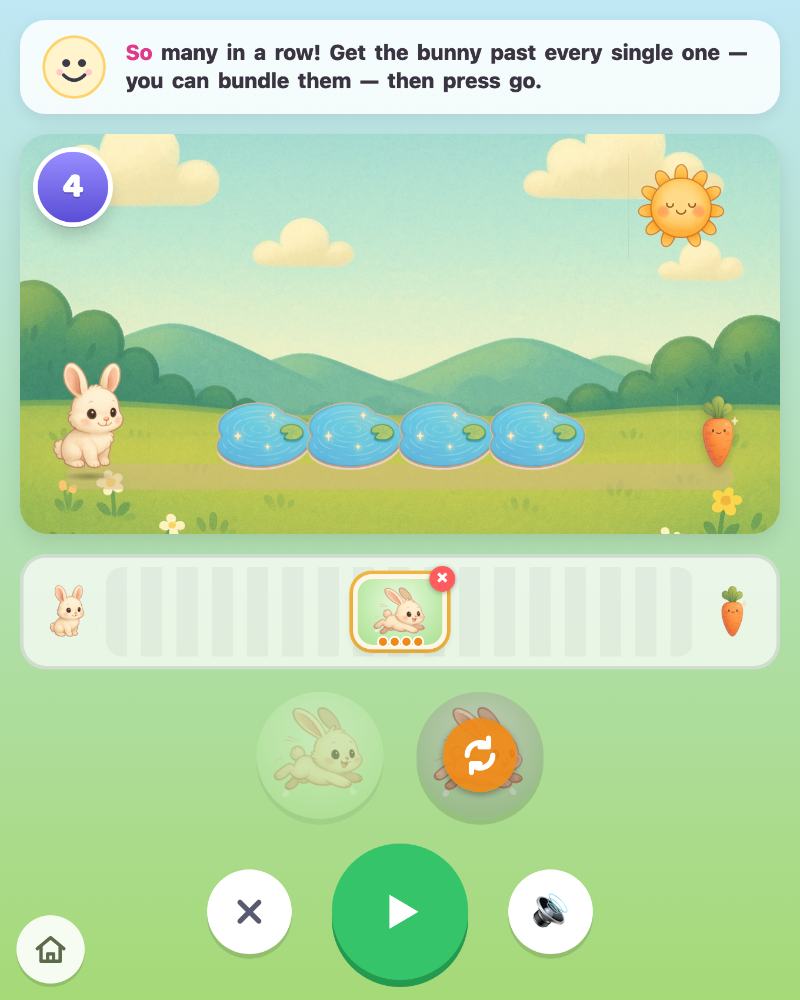
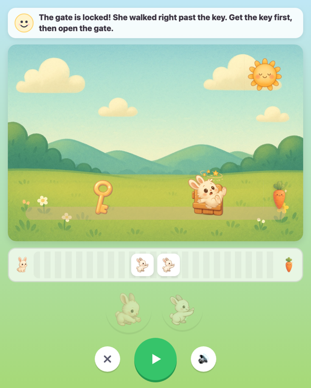
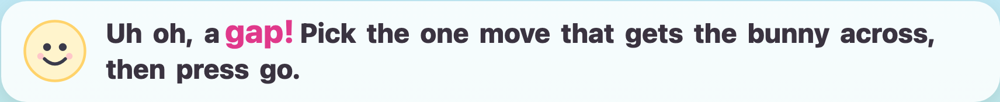

<div align="center">

# 🐇 Make It Go

### A no‑reading, no‑typing coding game for ages 3–7

Tap picture‑tokens to build a plan, press **go**, and the character does *exactly* what you said.




</div>

---

## What is this?

**Make It Go** teaches a child who *can't read yet* the core intuitions of programming — through play. She picks a theme, then solves a ladder of short challenges that get harder **one idea at a time**: sequence, literal execution (debugging), iteration, decomposition. A warm AI partner talks her through it by voice and decides when she's ready for the next idea.

Success is measured by **capability gained, never time on app**. The win condition is that she *outgrows it* and graduates to ScratchJr and beyond. The name says the loop: she builds a plan, taps **go**, and the character does exactly what she said.

## Why I'm building this

I have two kids — **Zoe** (2½) and **Autumn** (5). When I went looking for games to build the *foundation* under coding — sequence, cause and effect, "it does exactly what you say" — I found a surprisingly big gap: lots of flash, very little that genuinely builds capability at this age, before reading. So I started building the thing I actually wanted for Zoe and Autumn.

Underneath the play there's a real question I want to answer:

> **Can an AI partner make a pre‑literate child _more capable_ — by building on what she already knows, instead of marching her down a fixed path?**

That's the experiment. The app is the instrument; **the finding is the point.**

## What makes it different

- 🚫 **No reading, no typing, no microphone.** Input is large picture‑tokens she taps. Voice is output only.
- 🎯 **Literal execution is the lesson.** Her ordered plan runs exactly as written — a wrong action fails *visibly* (a stumble, a splash). The gap between what she meant and what she said *is* the debugging lesson. No autocorrect, ever.
- 🌱 **Growth over engagement.** No streaks, no timers, no leaderboards. Progress is mastery‑gated — each level unlocks only after the last idea is demonstrated.
- 🗣️ **A partner inside the play.** It reacts, narrates, and offers the right tool at the right moment — never an interrogation, never shame for a mistake.
- 📱 **Touch‑first**, runs on tablet and laptop, fully playable with audio off.

## How it plays

The character **walks itself** — walking is free, never something she programs. A level is a path of **event points**, each needing one action (a gap → jump, a branch → duck, a step → climb; later a key → grab, a gate → open).

She lays out an ordered row of action tokens, then taps **go**. The character advances and, at each event point in turn, performs the next action in her plan:

> **match → pass · mismatch → fail right there, visibly · reach the goal → win**

It's **plan‑first, then run** — no twitch input, no runner mechanic. Just "say what to do, then watch it happen."

## The capability ladder

Each level plants or reinforces **exactly one** idea, in order, and is reskinnable by any theme.

| Level | Idea | What she meets | Knowledge anchor |
|------:|------|----------------|------------------|
| **L1** | Sequence | one gap, two moves on the tray — pick the right one | *"It does exactly what you say."* |
| **L2** | Debugging | a gap **then** a step — right moves, right order | *"Steps happen in order."* |
| **L3** | Iteration | four gaps in a row — fold the run into one **repeat** chip | *"You can bundle steps and do them again."* |
| **L4** | Decomposition + cause/effect | grab the key, then open the gate — forget the key and the gate is **locked** | *"When it's wrong, find the wrong step and fix it."* |

Anchors are spoken in the **same childlike words every time** — that's what makes them stick — and map straight onto ScratchJr (script order, the repeat block) for the handoff.

## A look around

| The only front door | Iteration: fold many into one | Cause & effect |
|---|---|---|
|  |  |  |

As the partner speaks, **each word grows in time with the voice** — an early‑reading cue that ties the sound to the written word:



## Tech

React 18 · TypeScript · Vite · Vitest. The interpreter is **pure and theme‑agnostic** — fully unit‑tested (86 tests), with no engine logic ever forked per theme.

```
src/
  engine/      pure interpreter, mastery rules, levels, anchors  (tested)
  themes/      data-only packs over one engine (Bunny Meadow, Forest Fox)
  partner/     the "partner brain" behind one seam (local stub today, Claude next)
  narration/   ElevenLabs voice + karaoke word-timing (Web Speech fallback)
  telemetry/   capability signals — never time-on-app
  ui/          picker, track, plan strip, token tray, runner
```

A **theme is just data** — a hero, its poses, the obstacle/action art, a palette. Adding one is adding a pack, never touching the engine.

## Getting started

```bash
git clone https://github.com/paulmm/makeitgo.git
cd makeitgo
npm install
npm run dev          # open the printed localhost URL
npm test             # the engine + partner test suite
```

**Voice (optional).** Out of the box the partner uses the browser's built‑in voice. For the warm ElevenLabs voice with word‑level highlighting, add a key — it's read server‑side and never shipped to the browser:

```bash
# .env.local  (gitignored)
ELEVENLABS_API_KEY=your_key_here
# optional: ELEVENLABS_VOICE_ID, ELEVENLABS_MODEL_ID
```

## Non‑negotiables

No mic · no reading · no typing · no accounts · no ads · no streaks or timers · no walk token · no real‑time input · no turn/rotate tokens · the interpreter is never autocorrected · progression is never gated on time or attempt count. **Failure is never a dead end** — every wrong plan is a revise, with one good nudge from the partner, never the answer.

## Roadmap

- More original theme packs (royal/castle, trucks & diggers, space, dinosaurs)
- Server‑side `claudeBrain` partner (warm, patient readiness decisions)
- A grown‑ups dashboard + a "ready for ScratchJr" handoff
- Production voice endpoint for deploy

## License

Not licensed yet. MIT is a good fit for a tool meant to be outgrown and shared — add a `LICENSE` file before making the repo public.

---

<div align="center">
<sub>Built to be outgrown. 🐇 → 🦊 → ScratchJr → the world.</sub>
</div>
